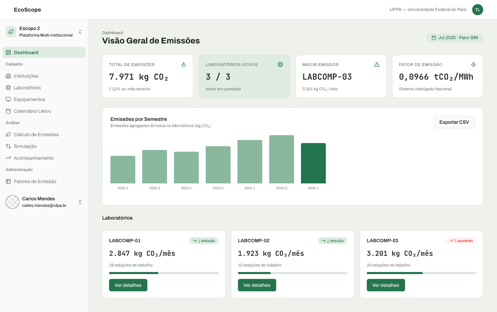
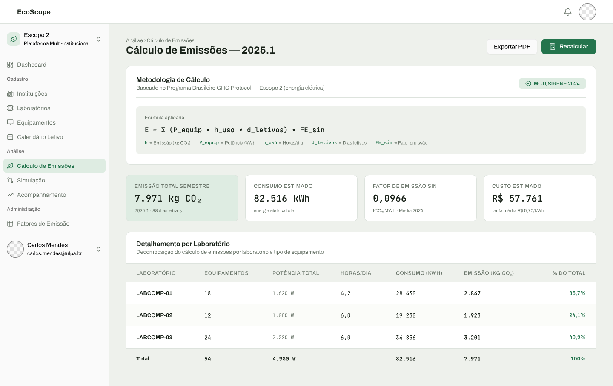
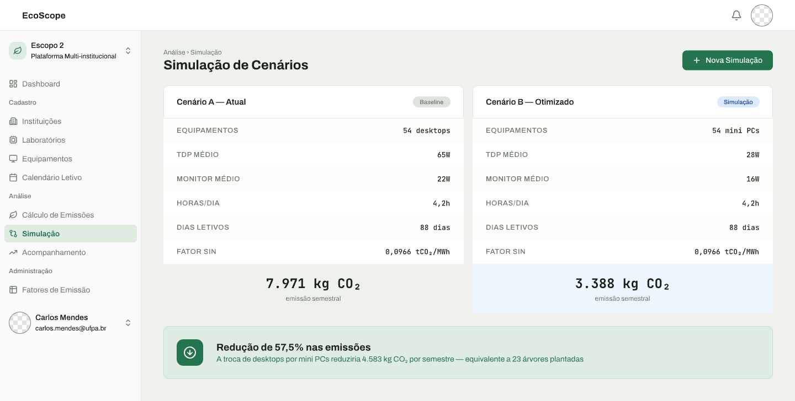
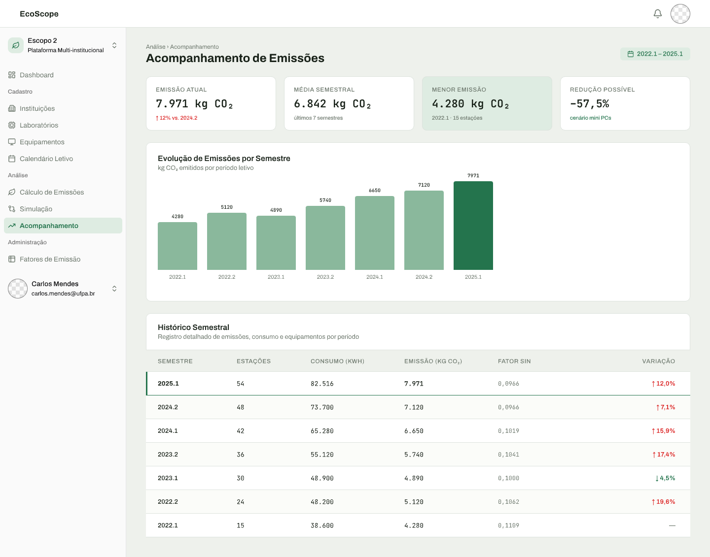

# Carbon Calculator

Plataforma para medir e acompanhar as emissões de carbono de escopo 2 de laboratórios de computação acadêmicos.

## O problema

Um estudo da FACOMP/UFPA mostrou que dá para estimar as emissões de escopo 2 de laboratórios de computação a partir da medição física do consumo elétrico. O resultado: **767 kg de CO₂ emitidos por 90 computadores ao longo de um período letivo**.

O problema é que o trabalho foi pontual e manual — um levantamento de campo, scripts rodados uma única vez, um painel estático. Nenhuma outra instituição consegue reaproveitá-lo. Para obter o próprio número, teria que repetir tudo do zero.

Ferramentas genéricas de pegada de carbono computacional resolvem a fórmula, mas não representam o que torna o problema institucional: instituições, laboratórios, calendário letivo, histórico entre semestres, e a forma específica como o fator de emissão brasileiro é publicado — nacional, mensal, com exceção para os sistemas isolados.

Esta plataforma transforma aquela metodologia manual em um serviço configurável, reaplicável por qualquer laboratório de computação brasileiro.

## Para quem

| Papel | O que faz na plataforma |
|---|---|
| **Gestor de laboratório** | Cadastra o parque, informa medições e obtém o resultado |
| **Coordenação / direção** | Consome resultados e simulações para decidir sobre renovação de parque, migração de SO e distribuição de horários |
| **Administrador** | Mantém os fatores de emissão oficiais atualizados para todas as instituições |
| **Pesquisador** | Replica ou estende o estudo em outra instituição |

## Princípios metodológicos

Estas restrições atravessam todo o produto e explicam boa parte das decisões de escopo:

1. **O dado vem de medição física ou de especificação de hardware — nunca de monitoramento automático por software.** Softwares de monitoramento superestimaram o consumo entre 48% e 58% e ignoraram os monitores conectados.
2. **O monitor é parte do equipamento, não um acessório.** Ignorá-lo é a principal fonte conhecida de subestimativa — em organizações estudadas, monitores eram 69% e 40% dos dispositivos.
3. **O registro é periódico, por instantâneos.** A plataforma não observa nada em tempo real.
4. **O fator de emissão é uma variável, não uma constante.** Varia por mês e por tipo de sistema elétrico.
5. **O calendário letivo transforma uma medição pontual em emissão de um período.** É ele que diz quantas vezes aquele consumo se repete.
6. **Toda instituição é um inquilino independente.** Ninguém enxerga ou edita o dado de outra.

## Funcionalidades

| # | Módulo | Descrição |
|---|---|---|
| 01 | [Acesso e papéis](docs/prds/01-acesso-e-papeis.md) | Autenticação, papéis e isolamento entre instituições |
| 02 | [Instituições e laboratórios](docs/prds/02-instituicoes-e-laboratorios.md) | Cadastro, incluindo o tipo de sistema elétrico que abastece cada laboratório |
| 03 | [Equipamentos](docs/prds/03-equipamentos.md) | Parque por modelo e quantidade, com monitor e sistema operacional |
| 04 | [Medições de consumo](docs/prds/04-medicoes-de-consumo.md) | Registro de medições de wattímetro ou de especificações de fabricante |
| 05 | [Calendário letivo](docs/prds/05-calendario-letivo.md) | Período, feriados e grade de ocupação dos laboratórios |
| 06 | [Cálculo de emissões](docs/prds/06-calculo-de-emissoes.md) | Resultado decomposto por laboratório, horário, dia da semana e mês |
| 07 | [Simulação de cenários](docs/prds/07-simulacao-de-cenarios.md) | Troca de equipamento, migração de SO ou nova ocupação, comparadas ao real |
| 08 | [Acompanhamento longitudinal](docs/prds/08-acompanhamento-longitudinal.md) | Instantâneos imutáveis por período letivo formando série histórica |
| 09 | [Fatores de emissão](docs/prds/09-fatores-de-emissao.md) | Fatores oficiais MCTI/SIRENE, mensais, com exceção para sistemas isolados |

Visão geral e questões em aberto: [`docs/prds/00-visao-geral.md`](docs/prds/00-visao-geral.md).

## Interface

Protótipos de alta fidelidade, feitos em [pen.dev](https://pen.dev) — arquivo em `design/TCC_carbon_calculator.pen`.

### Visão geral de emissões

Total do período, laboratório de maior emissão e o fator vigente, com a série por semestre e o estado de cada laboratório.



### Cálculo de emissões

A fórmula aplicada fica visível junto do resultado, e o detalhamento por laboratório mostra potência, horas por dia, consumo e participação no total — atendendo ao requisito de que o gestor consiga defender o número.



### Simulação de cenários

Configuração hipotética comparada lado a lado com a real, com diferença absoluta e percentual — aqui, a troca de desktops por mini PCs.



### Acompanhamento longitudinal

Série histórica formada por instantâneos imutáveis, um por período letivo, com o fator de emissão aplicado em cada um.



<details>
<summary>Demais telas</summary>

| Tela | Captura |
|---|---|
| Cadastro de instituição | [`02-cadastro-instituicao.png`](docs/screenshots/02-cadastro-instituicao.png) |
| Equipamentos | [`03-equipamentos.png`](docs/screenshots/03-equipamentos.png) |
| Adicionar equipamento | [`03b-adicionar-equipamento.png`](docs/screenshots/03b-adicionar-equipamento.png) |
| Laboratórios | [`04-laboratorios.png`](docs/screenshots/04-laboratorios.png) |
| Calendário letivo | [`05-calendario-letivo.png`](docs/screenshots/05-calendario-letivo.png) |
| Fatores de emissão | [`09-fatores-emissao.png`](docs/screenshots/09-fatores-emissao.png) |

</details>

## Stack

| Camada | Tecnologia |
|---|---|
| Back-end | Java 25 · Spring Boot 4.1.1 · Spring Data JPA · Spring Security |
| Banco | PostgreSQL 18 · migrations com Flyway |
| Front-end | React 19 · Vite 8 · TypeScript · Bun |
| UI | shadcn/ui · Radix · Tailwind CSS 4 |

O raciocínio por trás dessas escolhas está em [ADR-001](docs/adr/001-stack-spring-boot-react-vite-bun-shadcn-postgres.md); a paleta e a tipografia, em [ADR-002](docs/adr/002-tema-visual-e-paleta-de-cores.md).

## Estrutura

```
client/     Front-end React + Vite
server/     Back-end Spring Boot
docs/adr/   Decisões de arquitetura
docs/prds/  Requisitos de produto
design/     Protótipos visuais (.pen)
.spec/      Constituição do projeto e verificações
```

## Como rodar

Pré-requisitos: **JDK 25**, **Bun** e **Docker** (ou um PostgreSQL 18 local).

```bash
cp .env.example .env     # ajuste as credenciais
docker compose up -d db  # sobe o PostgreSQL
```

Back-end, em `server/` — sobe em `http://localhost:8080`:

```bash
./mvnw spring-boot:run
```

Front-end, em `client/` — sobe em `http://localhost:5173`, com `/api` apontando para o back-end:

```bash
bun install
bun dev
```

## Status

Em desenvolvimento. O repositório contém a estrutura do projeto, as decisões de arquitetura e os requisitos; as funcionalidades ainda não foram implementadas.

O critério de validação do trabalho é reproduzir os 767 kg de CO₂ do estudo da FACOMP a partir dos mesmos dados de entrada.

## Contexto acadêmico

Trabalho de Conclusão de Curso. A plataforma generaliza o estudo de Corrêa, Cardoso e Kawasaki (FACOMP/UFPA) sobre emissões de escopo 2 em laboratórios de computação.
